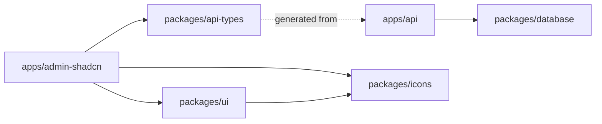

# Contributing

Developer handbook for `nestjs-boilerplate`. Reading this end-to-end should get you from a fresh clone to a merged PR without surprises.

> [!NOTE]
> The root [`README.md`](./README.md) covers **what** this repo is. This document covers **how** to work on it.

## Table of Contents

- [Prerequisites](#prerequisites)
- [First-Time Setup](#first-time-setup)
- [Repository Layout](#repository-layout)
- [Development Workflows](#development-workflows)
- [Testing](#testing)
- [Code Quality](#code-quality)
- [Git & Pull Requests](#git--pull-requests)
- [Debugging & Observability](#debugging--observability)
- [Troubleshooting](#troubleshooting)

---

## Prerequisites

- **Node.js** 22+
- **pnpm** 10.32+ (pinned via `packageManager` in `package.json`)
- **Docker** (for local PostgreSQL + Redis)
- **Git**

> [!TIP]
> Use `corepack enable` to get the pinned pnpm version automatically.

## First-Time Setup

Five commands from clone to running apps:

```bash
git clone https://github.com/oNo500/nestjs-boilerplate.git
cd nestjs-boilerplate

pnpm install                                         # 1. Install deps (auto-copies .env.example → .env)
docker compose -f docker/docker-compose.yml up -d    # 2. PostgreSQL :5432 + Redis :6379
pnpm --filter @workspace/database build              # 3. Build shared database types
pnpm --filter @workspace/database db:push            # 4. Apply schema to local DB
pnpm dev                                             # 5. Start API + admin in parallel
```

> [!IMPORTANT]
> `pnpm install` triggers the `prepare` script which copies `.env.example` → `.env` for `apps/api`, `apps/admin-shadcn`, and `packages/database`. To force-reset, run `pnpm setup:env`.

### Verify the stack

After `pnpm dev` settles, confirm each endpoint:

- API: <http://localhost:3000/health>
- API docs (Scalar): <http://localhost:3000/api>
- OpenAPI spec: <http://localhost:3000/openapi.yaml>
- Admin panel: <http://localhost:8080>

If any of these fail, jump to [Troubleshooting](#troubleshooting).

## Repository Layout

```
nestjs-boilerplate/
├── apps/
│   ├── api/              # NestJS backend (:3000) — DDD layered architecture
│   └── admin-shadcn/     # Next.js App Router frontend (:8080)
├── packages/
│   ├── database/         # @workspace/database  — Drizzle schemas & migrations
│   ├── api-types/        # @workspace/api-types — OpenAPI-generated types
│   ├── ui/               # @workspace/ui        — Shared components (shadcn + Base UI)
│   └── icons/            # @workspace/icons     — Shared icon set
├── docker/               # Local Postgres + Redis compose
├── docs/                 # Deep-dive topics (deployment, architecture)
└── .claude/rules/        # AI-facing architectural rules (see below)
```

### Workspace dependencies

Inter-package dependencies use the `workspace:*` protocol. The dependency direction is strict:



> [!WARNING]
> `packages/api-types` is **generated** from the running API — never hand-edit `openapi.d.ts`. See [Sync API types to the frontend](#3-sync-api-types-to-the-frontend).

### Where do the rules live?

Architectural rules are under `.claude/rules/` and load automatically for AI assistants via `paths:` frontmatter. They are the **authoritative reference** for humans too:

- `constitution.md` — project-wide principles
- `api.md` — DDD layering, context boundaries, communication patterns
- `admin-shadcn.md` — feature-based organization, UI conventions
- `database.md` — schema ownership, migration workflow
- `api-test.md` — test layering and fixture conventions

When in doubt, read the relevant rule file before writing code.

## Development Workflows

### 1. Add an API module (new bounded context)

Use `modules/article` or `modules/order` as a reference implementation. Each context owns its own folder under `apps/api/src/modules/` with the full DDD stack:

```
modules/{context}/
├── domain/                # Only when the context is complex — zero external deps
│   ├── aggregates/
│   ├── entities/
│   ├── value-objects/
│   └── events/
├── application/
│   ├── ports/             # Interface contracts, e.g. {context}.repository.port.ts
│   ├── services/          # Single file by default; split when > 10 methods
│   └── listeners/         # Domain / integration event listeners
├── infrastructure/
│   ├── repositories/      # Implement ports
│   └── adapters/          # Third-party APIs, message queues
├── presentation/
│   ├── controllers/
│   └── dtos/
└── {context}.module.ts
```

**Dependency direction** (acyclic):

```
presentation → application/services → application/ports ← infrastructure
                         ↓
                      domain (optional)
```

**Cross-context rules** — contexts must not `import` from each other. Two legal channels only:

- **Port contract** (sync, needs return value) — define the interface under `shared-kernel/application/ports/`, implement in the owning context, consume via `@Inject(TOKEN)`.
- **Event contract** (async, side effect) — publisher emits a domain event; consumer declares `@OnEvent()` under its own `application/listeners/`.

> [!TIP]
> Decision rule: can you describe the context's responsibility in one sentence *after* adding the feature? If the sentence needs "and" to join heterogeneous concepts, create a new context. Full rules in [`.claude/rules/api.md`](./.claude/rules/api.md).

### 2. Change the database schema

Schemas live in `packages/database/src/schemas/`. The golden rule: **rebuild before anything downstream consumes the new types.**

```bash
# 1. Edit the schema file
$EDITOR packages/database/src/schemas/{domain}.schema.ts

# 2. Update relations if foreign keys changed
$EDITOR packages/database/src/relations.ts

# 3. Rebuild so downstream packages see new types
pnpm --filter @workspace/database build

# 4. Apply to dev DB
pnpm --filter @workspace/database db:push

# 5. Or generate a migration file for prod
pnpm --filter @workspace/database db:generate
```

> [!WARNING]
> Never edit files under `packages/database/drizzle/` — they are generated by `drizzle-kit`. Deleting or renaming a schema requires updating `relations.ts` in the same commit.

**Schema ownership** is enforced:

- `schemas/identity/` — owned by the `identity` context; must stay Better Auth-compatible
- `schemas/audit/` — owned by the `audit-log` context
- `schemas/{domain}.schema.ts` — single-domain schemas at the top level

### 3. Sync API types to the frontend

`@workspace/api-types` is generated from the live OpenAPI spec. After any backend endpoint change:

```bash
# Terminal 1 — API must be running
pnpm --filter api dev

# Terminal 2 — regenerate types
pnpm --filter @workspace/api-types api:gen
```

The frontend imports from `@workspace/api-types` and consumes via `openapi-fetch` + `openapi-react-query`. TypeScript will fail the build if types drift.

### 4. Add an admin page (new feature)

Features live under `apps/admin-shadcn/src/features/`. A feature typically maps 1:1 to a backend context:

```
src/features/{feature}/
├── components/          # Feature-local components (optional)
├── hooks/               # Feature-local hooks (optional)
└── {entry}.tsx          # Feature entry component
```

Routes live in `src/app/` (Next.js App Router). Keep route files thin — push business logic down into `features/`.

> [!WARNING]
> No barrel files (`index.ts`) under `features/`. Import from source directly. See [`.claude/rules/admin-shadcn.md`](./.claude/rules/admin-shadcn.md) for the full list of prohibited patterns.

**Route paths**: use `src/config/app-paths.ts`, never hard-code strings in components.

**RBAC**: import `RoleType` / `ROLES` / `hasRequiredRole` from `@/lib/rbac`; use `<RequireRole>` / `<ShowForRole>` for guards. Never hand-write role strings.

### 5. Add a shadcn/ui component

Components in `packages/ui/src/components/` are managed by the **shadcn CLI** — do not hand-edit. To add a new component:

```bash
cd packages/ui
pnpm dlx shadcn@latest add {component-name}
```

> [!IMPORTANT]
> The shared UI library is built on `@base-ui/react`, which does **not** support Radix-style `asChild`:
> - `DropdownMenuTrigger` uses the `render` prop
> - `Button` is composed via style anchor

## Testing

### Test layering

- **Unit tests** (`*.spec.ts`) — colocated next to source. Cover `application/services/` and `domain/`.
- **E2E tests** (`*.e2e-spec.ts`) — under `apps/api/src/__tests__/`. Cover `presentation/controllers/` and `infrastructure/repositories/` against a real database.

Controllers and repositories have **no unit tests** — E2E is their only coverage. Domain objects are instantiated directly, never mocked.

### TDD is non-negotiable

Red-Green-Refactor. No implementation before its test. Tests drive from `application/services/`; port interfaces are added as needed; implementation follows the tests.

### Commands

```bash
pnpm --filter api test              # Unit tests (Vitest)
pnpm --filter api test:e2e          # E2E tests (Vitest + Supertest + real DB)
pnpm --filter admin-shadcn test     # Frontend unit tests (Vitest + Testing Library + MSW)
turbo test                          # All packages
```

### Mocks and fixtures

- Mock port interfaces with `createMock<T>()` from `@golevelup/ts-vitest`
- Instantiate services via `new` by default; only use `Test.createTestingModule` when a NestJS-provided dependency is required (`ConfigService`, `JwtService`, etc.)
- Per-context mock providers live in `apps/api/src/__tests__/unit/factories/mock-factory.ts`
- Domain fixtures live in `apps/api/src/__tests__/unit/factories/domain-fixtures.ts` — constructed via aggregate factory methods or `reconstitute`, never via DTOs or the database

### E2E isolation

E2E test data is namespaced via `globalThis.e2ePrefix` (timestamp-based) so concurrent suites do not contaminate each other. The E2E setup lives in `apps/api/src/__tests__/setup.ts`.

## Code Quality

Linting and formatting are powered by **oxlint** + **oxfmt** (Rust, fast) via the `@infra-x/code-quality` preset package. There is **no ESLint or Prettier**.

```bash
turbo lint           # Check
turbo lint:fix       # Auto-fix
turbo format         # Auto-format
turbo format:check   # CI check (no writes)
turbo typecheck      # tsc across all packages
turbo build          # Build all
```

### Pre-merge checklist (run locally before pushing)

```bash
turbo lint typecheck test
```

> [!NOTE]
> There is no `husky` / `lefthook` pre-commit hook. CI will catch violations, but running the checklist locally saves a round-trip.

### TypeScript diagnostics

After a batch of edits, run `turbo typecheck` to verify. Do **not** trust LSP diagnostics pushed during editing — they can be stale snapshots. Only `tsc` output is authoritative.

## Git & Pull Requests

### Branching

- `master` — main line; PRs merge here
- `dev` — integration branch (CI also gates on this)
- Feature branches: `feat/<scope>`, `fix/<scope>`, `chore/<scope>`, `docs/<scope>`

### Commit messages — Conventional Commits (required)

Format: `type(scope): subject`

**Types**: `feat` · `fix` · `chore` · `docs` · `refactor` · `test` · `perf` · `style`

**Examples from this repo**:

```
feat(rbac): add ADMIN route-group guard layout
fix(data-table): render Table shell during loading to stop layout flash
chore(ui): ignore shadcn-managed dirs in prettier
refactor(admin): collapse sidebar into Management + Settings
docs(rules): add RBAC notes to api and admin-shadcn rules
```

> [!IMPORTANT]
> All commit messages, PR titles, PR descriptions, and code comments must be in **English**.

### Pull requests

Opening a PR auto-loads [`.github/pull_request_template.md`](./.github/pull_request_template.md). Fill out every section — the template exists to prevent the "what is this?" review round-trip.

CI runs on every PR to `master` or `dev`:

- `lint → typecheck → build → unit tests` (one job)
- `E2E tests` with live Postgres + Redis services (separate job)

Merge only when both jobs are green.

## Debugging & Observability

### Structured logging

Logger: `nestjs-pino` + `pino-http`. Config lives in `apps/api/src/app/logger/logger.config.ts`. HTTP logs are emitted only for `/api/*` routes (allowlist), with automatic sensitive-field redaction and request-ID correlation.

### Local tooling

- **Scalar API reference**: <http://localhost:3000/api> — interactive API explorer
- **OpenAPI spec**: <http://localhost:3000/openapi.yaml> — raw spec, source of truth for `api-types`
- **Health check**: <http://localhost:3000/health>
- **Drizzle Studio**: `pnpm --filter @workspace/database db:studio` — web UI for the local database

### Deployment

See [`docs/deployment.md`](./docs/deployment.md) for the GCP Cloud Run deployment guide.

## Troubleshooting

### `pnpm install` fails on native modules

Some dependencies (`bcrypt`, `better-sqlite3`, `@swc/core`) require native build steps. They are allowlisted under `pnpm.onlyBuiltDependencies` in root `package.json`. If install fails, ensure you have build tools available (`xcode-select --install` on macOS, `build-essential` on Linux).

### `pnpm dev` — port already in use

```bash
lsof -i :3000    # Find the process on the API port
lsof -i :8080    # Admin panel
lsof -i :5432    # Postgres
lsof -i :6379    # Redis
```

Kill the process or change the port in the relevant `.env`.

### API starts but admin shows 500s on API calls

The `@workspace/api-types` types are likely stale. Regenerate them with the API running:

```bash
pnpm --filter @workspace/api-types api:gen
```

### `db:push` fails with "relation does not exist" or type errors

The database package was not rebuilt after a schema change. Run:

```bash
pnpm --filter @workspace/database build
pnpm --filter @workspace/database db:push
```

### Docker services won't start

```bash
docker compose -f docker/docker-compose.yml down -v   # Remove volumes
docker compose -f docker/docker-compose.yml up -d     # Start fresh
```

> [!CAUTION]
> `down -v` deletes the local database volume. You will need to re-run `db:push` and re-seed.

### E2E tests pass locally but fail in CI

CI uses `bitnami/postgresql:latest` and `redis:7-alpine` as service containers. If your test relies on a specific extension or locale, declare it in the schema rather than relying on the local Docker image's defaults.

### Stale TypeScript errors after pulling new code

```bash
pnpm install                              # Ensure new deps are present
pnpm --filter @workspace/database build   # Rebuild generated types
pnpm --filter @workspace/api-types api:gen # If backend endpoints changed
turbo typecheck                           # Verify
```

---

**Questions not answered here?** Open an issue or start a discussion — missing docs are bugs.
