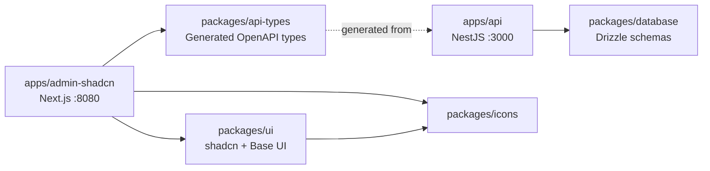
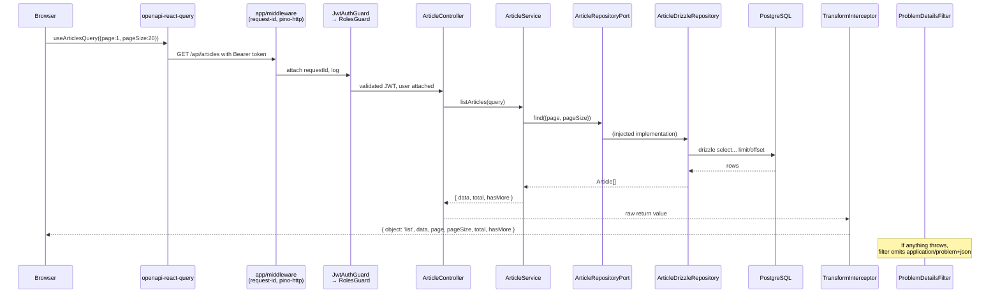

# Architecture

A 5-minute tour of how `nestjs-boilerplate` is laid out, what each piece owns, and how a request flows end-to-end. Pair this with [`api-conventions.md`](./api-conventions.md) for the HTTP contract and [`technology-choices.md`](./technology-choices.md) for the "why these libraries."

## Guiding Principles

Four ideas drive most decisions in this repo. Each is visible in the code, not just on paper.

- **MVP-first** — a context only gets a `domain/` layer when it needs one. `todo` is an anemic CRUD; `order` is full DDD. No speculative abstraction.
- **Library-first** — reach for mature libraries (Better Auth, Drizzle, class-validator, NestJS built-ins) before hand-rolling. The project is a showcase of *how to wire them*, not of bespoke frameworks.
- **Test-driven** — unit tests colocate with sources (`foo.ts` + `foo.spec.ts`), E2E tests hit a real database. The Red-Green-Refactor loop drives port design.
- **Functional-first, isolated side effects** — domain layer is pure; all I/O (DB, cache, HTTP) sits behind ports in `infrastructure/`.

These are codified in [`.claude/rules/constitution.md`](../.claude/rules/constitution.md).

## Monorepo Layout



- `apps/*` are deployable units
- `packages/*` are shared libraries, declared via `workspace:*`
- `api-types` is **generated** from the running API's OpenAPI spec — never hand-edited

## Backend: `apps/api`

### Three-tier directory

```
apps/api/src/
├── app/              # Framework glue — no business semantics
├── modules/          # Bounded contexts — one per business capability
└── shared-kernel/    # Cross-context contracts only
```

**`app/`** holds everything that is *not* a business decision:

- `config/` — env schema, Swagger, security headers
- `database/` — `DrizzleModule`, exports `DB_TOKEN`
- `events/` — `DomainEventsModule` (NestJS `EventEmitter` wrapper)
- `filters/` — global exception filter emitting RFC 9457 Problem Details
- `interceptors/` — response envelope transformer, logging, ETag generator
- `middleware/` — HTTP middleware (CORS, request ID, pino-http)
- `logger/` — nestjs-pino config with field redaction

**`modules/`** is the business surface. Each subdirectory is a **bounded context** that owns an aggregate root and a one-sentence responsibility. Contexts never import each other.

**`shared-kernel/`** holds cross-context contracts *only* — base classes, generic DTOs, port interfaces, error codes. Zero concrete implementations, zero business rules. Admission requires the Rule of Three (used by ≥ 3 contexts in the same way).

### Context internal structure (DDD layers)

```
modules/{context}/
├── domain/                # Pure business — only when complexity warrants
│   ├── aggregates/
│   ├── value-objects/
│   ├── events/
│   └── entities/
├── application/
│   ├── ports/             # Interface contracts (repository ports, external ports)
│   ├── services/          # Orchestrate business flows
│   └── listeners/         # @OnEvent handlers for domain / integration events
├── infrastructure/
│   ├── repositories/      # Implement ports against Drizzle
│   └── adapters/          # Third-party APIs, message queues
├── presentation/
│   ├── controllers/       # HTTP handlers, validation, response shaping
│   └── dtos/              # Request / response DTOs with class-validator
└── {context}.module.ts
```

Dependency direction is strict and acyclic:

```
presentation → application/services → application/ports ← infrastructure
                       ↓
                    domain (optional)
```

**Layer rules**:

- `app/` may not import from `modules/`
- `domain/` may not depend on any external library (pure TypeScript)
- `application/services/` may not inject the DB client directly — only through a port
- `infrastructure/` implements ports; makes no business decisions

### DDD opt-in by context

Not every context needs a `domain/` layer. The rule is: **add the layer only when you have real business invariants to protect.**

- `todo` — anemic CRUD, no `domain/`. Service talks to repository directly through a port.
- `auth` — has `domain/events/` only (login events drive audit logging).
- `identity` — minimal `domain/events/`, relies on Better Auth for rules.
- `article` — full DDD: aggregate root, value objects, events.
- `order` — full DDD: aggregate with a state machine, `Money` and `OrderItem` value objects, four domain events (created/paid/shipped/cancelled), optimistic locking via `version`.

> [!TIP]
> When adding a module, start anemic. Promote to full DDD only when state transitions get non-trivial or invariants emerge.

### Inter-context communication

Contexts must not `import` each other. Two legal channels:

- **Port contract** (sync, needs return value) — interface defined under `shared-kernel/application/ports/`, implementation lives in the owning context and is exported via `@Global()` token. Consumers inject via `@Inject(TOKEN)`.
- **Event contract** (async, side effect) — publisher emits a domain event; consumer declares `@OnEvent()` under its own `application/listeners/`. Publisher knows nothing about consumers.

Decision rule:

- Needs return value → **Port contract**
- Triggers side effect → **Event contract**
- Shared by ≥ 3 contexts → extract as a shared subdomain (its own context, e.g. `identity`)
- Bidirectional dependency → boundaries are wrong; merge and re-split

Only four modules may be `@Global()`: `DrizzleModule`, `cache`, `audit-log`, `DomainEventsModule`. Everything else is scoped.

## Frontend: `apps/admin-shadcn`

### Feature-based organization

```
apps/admin-shadcn/src/
├── app/              # Next.js App Router — routing only, no business logic
├── features/         # Business modules — typically 1:1 with a backend context
│   └── {feature}/
│       ├── components/
│       ├── hooks/
│       └── {entry}.tsx
├── components/       # Cross-feature shared components
├── hooks/            # Cross-feature shared hooks
├── lib/              # Third-party wrappers (api-client, query-client, rbac)
├── config/
│   ├── env.ts        # @t3-oss/env-nextjs schema
│   └── app-paths.ts  # Centralized route paths
└── testing/          # renderWithProviders, MSW fixtures
```

**Key constraints**:

- Route files in `app/` stay thin — push logic down into `features/`
- **No barrel files** (`index.ts`) under `features/` — import from source directly to keep the dependency graph explicit
- Route paths come from `config/app-paths.ts`, never hard-coded in components
- RBAC uses `<RequireRole>` / `<ShowForRole>` components and `hasRequiredRole()` from `@/lib/rbac` — never hand-written role strings

### Feature ↔ Context mapping

A frontend feature typically maps 1:1 to a backend context. Promote a component to `src/components/` only when ≥ 2 features need it. Collections are plural (`articles`, `audit-logs`), workflows are singular (`auth`, `settings`).

## Data Flow: One Request End-to-End

Following "GET `/api/articles?page=1&pageSize=20`":



Key points:

- **Guards run before the controller** — JWT validation, then role check. Public endpoints opt out via `@Public()`.
- **Controller never talks to the DB** — always through the service, which always goes through a port.
- **Repository is the only place Drizzle is imported** — swap implementations without touching business code.
- **TransformInterceptor wraps collections** into `{ object: 'list', data, ... }`; single resources pass through unchanged.
- **Errors never leak raw** — every throw is caught by `ProblemDetailsFilter` and shaped to RFC 9457.

## Testing Topology

- `application/services/` + `domain/` → **unit tests** (`.spec.ts`, colocated)
- `presentation/controllers/` + `infrastructure/repositories/` → **E2E only** (`.e2e-spec.ts`, under `src/__tests__/`)

Controllers and repositories have no unit tests — they are thin enough that mocked tests would test the wrong thing. E2E uses a real PostgreSQL, isolated via a timestamp-based `globalThis.e2ePrefix`.

Mocks target ports via `createMock<T>()`. Domain objects are never mocked — they are instantiated directly. Services are instantiated via `new` unless a NestJS-provided dependency (like `ConfigService`) forces `Test.createTestingModule`.

## Further Reading

- [`api-conventions.md`](./api-conventions.md) — HTTP contract: URLs, responses, errors, pagination, auth, idempotency, optimistic locking
- [`technology-choices.md`](./technology-choices.md) — why Drizzle, why Base UI, why DDD double-standard, why oxlint
- [`.claude/rules/api.md`](../.claude/rules/api.md) — full backend layering and context boundary rules
- [`.claude/rules/admin-shadcn.md`](../.claude/rules/admin-shadcn.md) — full frontend rules
- [`.claude/rules/database.md`](../.claude/rules/database.md) — schema ownership and migration workflow
- [`.claude/rules/constitution.md`](../.claude/rules/constitution.md) — project-wide principles
